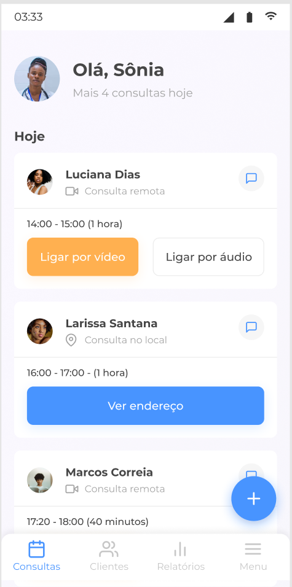
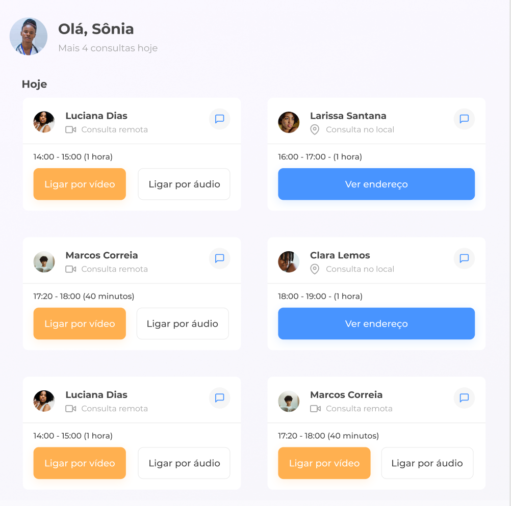
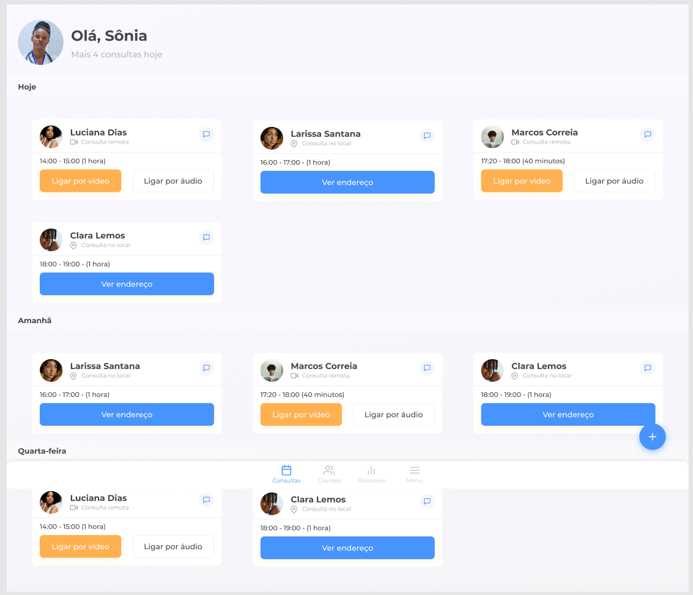

# Clinica Médica

Uma landing page de uma aplicação para médicos realizar atendimentos via ligação telefônica ou via chamada de vídeo.
Um desafio do #7Day
## Índice

* [Visão Geral](#visão-geral)
* [Funcionalidades](#funcionalidades)
* [Tecnologias Utilizadas](#tecnologias-utilizadas)
* [Layout](#layout)
* [Como Usar](#como-usar)

---

## Visão Geral

Este é um projeto de uma aplicação web que permite um médico logar e visualizar seus atendimentos na data de hoje. Onde o mesmo pode realizar oa tendimento via chama de vídeo ou por ligação sem vídeo.

## Funcionalidades

Abaixo as principais funcionalidades ou características do projeto.

* Visualizar a lista de pasciente na data de hoje

## Tecnologias Utilizadas

Abaixo as principais tecnologias que está sendo utilizada para construir este projeto.

* **Linguagens**: [HTML, CSS] (Mesmo nao sendo linguagem e sim marcação de texto)
* **Ferramentas**: [Git, Figma]
* **Link do Repositório**: [https://github.com/denisiorodrigues/landing-page-clinica-medica.git](https://github.com/denisiorodrigues/landing-page-clinica-medica.git)

## Layout

### Mobile


### Tablet


### Desktop



[Figma do projeto](https://www.figma.com/design/4OjHFmeHAgfX2JpRymOeA0/7days---Responsividade?node-id=6-622)

## Como Usar

1.  **Clone o repositório:**
    ```bash
    git clone https://github.com/denisiorodrigues/landing-page-clinica-medica.git
    ```
2.  **Navegue até a pasta do projeto:**
    ```bash
    cd apperia
    ```
3. **Execute a aplicação:**

    Instalar a extenção **Live Server** no VS Code ou clicar no arquivo index.html 
